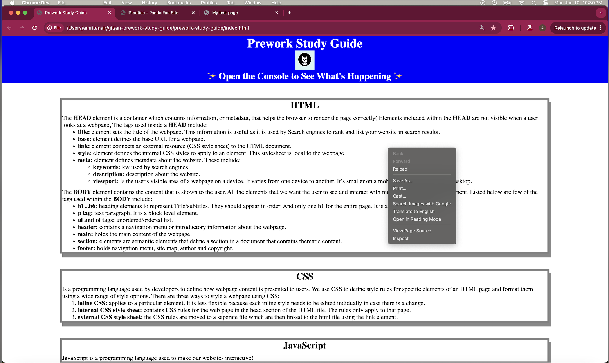
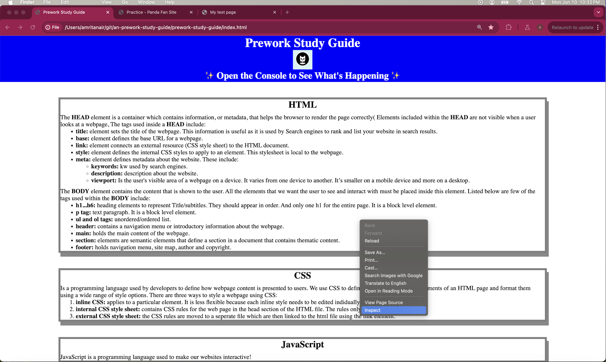
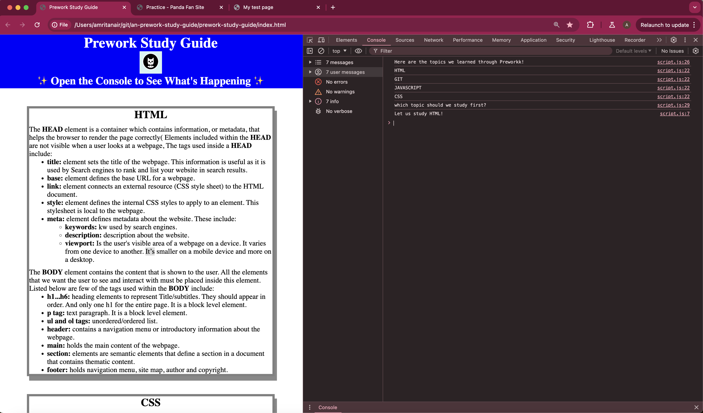

# Web Development Prework Study Guide

## Description

This project was developed to learn some basic web devlopment technologies like: HTML, CSS, JavaScript and GIT. It also captures some high level notes in each of these topics that can be used as a reference later on.
Provide a short description explaining the what, why, and how of your project. Use the following questions as a guide:

## Installation

N/A

## Usage

To use this guide, you can refer to the notes in each section. For suggestions on what to study first, open the developers console by following the below instructions: 
1. Right-click on the web page
   
2. Select Inspect
   
3. Select 'console' on the window that openes on the right of the screen. You should see an output as below which lists all the topics and also provides a suggestion at the end on which topic to start with.
   

## Credits

N/A

## License

Please refer to the LICENSE in this repo.
